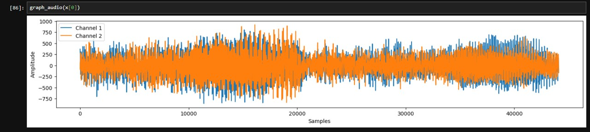
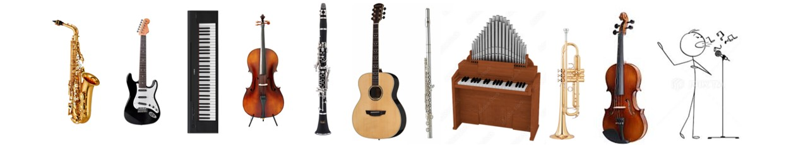
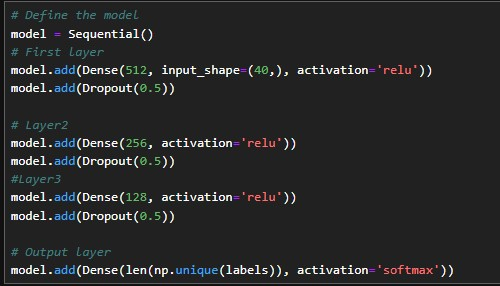
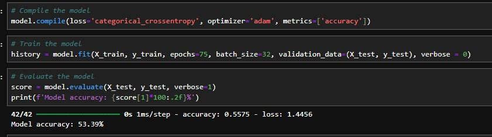
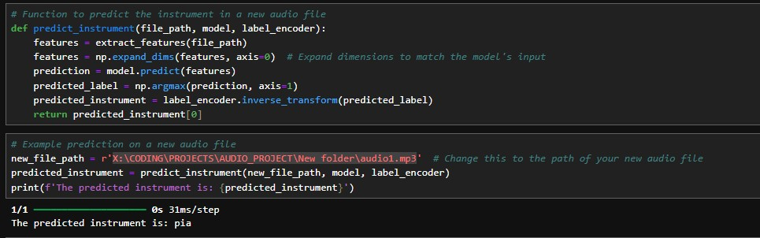
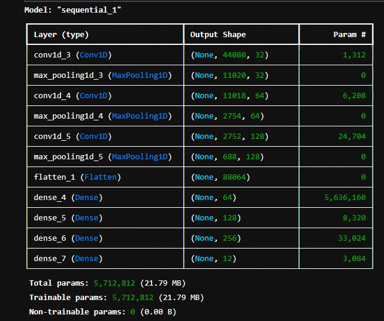
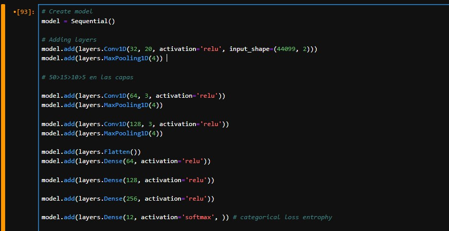
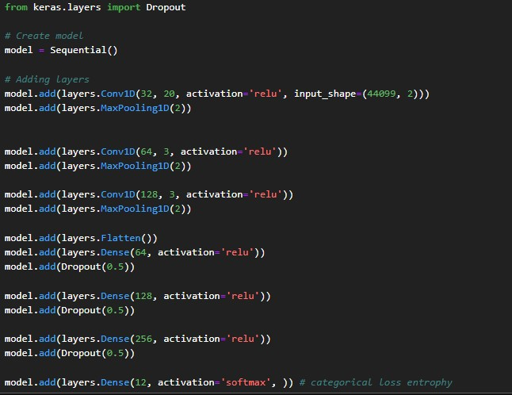
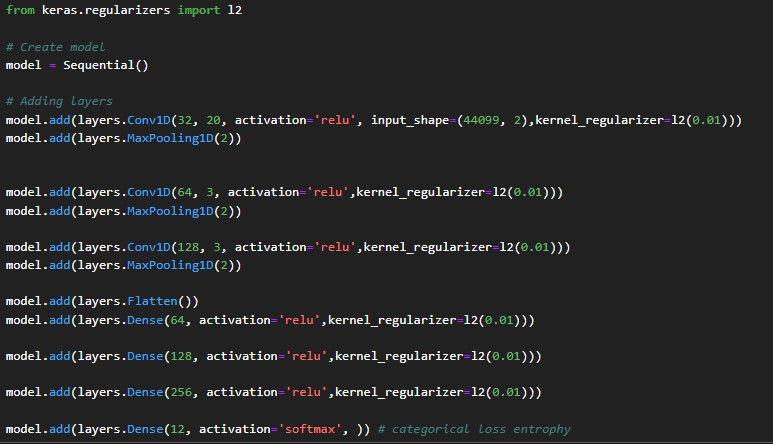

# AUDIO_CLASSIFIER

This project has a sound classifier using both CNN and Dense layers trained with IRMAS dataset. The objective was to create an algorythm that, depending on the audio you send him, it will let you know which instrument is being played from the training dataset  🎷   

After exploring our data and let's say "having fun with it" (see picture below), we have created 2 ML models

The model with ``Dense layers`` gives us with around 55% of accuracy while the one that uses `` Convolutional layers `` falls into overfitting.

The instruments that the dataset has are the following ones: 

* Cello (cel) 🎻
* Clarinet (cla) 🎶
* Flute (flu) 🎵
* Acoustic Guitar (gac) 🎸
* Electric Guitar (gel) 🎸
* Organ (org) 🎹
* Piano (pia) 🎹
* Saxophone (sax) 🎷
* Trumpet (tru) 🎺
* Violin (vio) 🎻
* Human Singing Voice (voi) 🎤

## Dense Layers model:
This is the structure of the model using dense layers:

As we can see we have an acceptable accuracy rate:

So one example of use of this model would be:

## Convolutional Layers model:
After properly prepare the data that we will use and how we are going to use it, we proceed to create from scratch one model with the following structure:

As we can see we have overfitting so we are going to add a dropout layer to the model and see what happens

The quality of the results is not good so we are going to try using L2 regulatization by adding it to the model and see the result

We still have overfitting so we cannot say that this model has a good performance.
After seeing these results and as we cannot spend an eternity of time only with this project, we can determine that the model with CNN tends to overfit, learning by heart (which is paradoxical to say that from a ML model) the training.

We therefore can say that sometimes we win, sometimes we learn (actually we always learn). 

This has been a very fun project as I have made from scratch everything and even if the results are not the best ones, it has been really funny to interact with these libraries and content.
